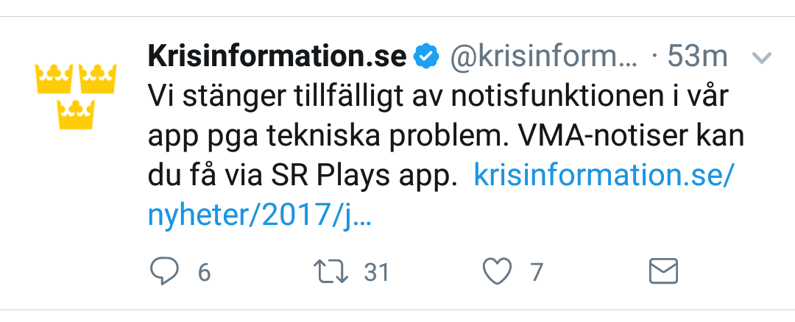

# Projekt "Viktigt meddelande"

### Viktiga meddelanden tillgängliga på Internet

Vid Hesa-Fredrik-incidenten i Stockholm 2017-07-09, visade det sig att de internetbaserade systemen som finns idag, inte fungerade.

Ett falsklarm gick ut och webbsajter som folk gick till för att få information var inte tillgängliga. Detta berodde kanske inte ens på en attack utan bara på en överbelastning. Vad gäller attacker är datorer och mobiltelefoner idag så lätta att hacka att det är svårt att skydda en enskild resurs mot en koncentrerad attack.  

Att skicka ut viktiga meddelanden från en enskild Internet-resurs som t ex en webbsajt har därför visat sig att inte vara tillförlitligt nog. Förmodligen det enda sättet att kommunicera tillförlitligt över Internet idag är distribuerat (genom flera kanaler) och använda redundanta digitala signaturer.

När det blir kriser, eller bara allmän förvirring, är det viktigt att korrekt information kommer fram.

Det vore bra om man kunde ta fram system för viktiga meddelanden som faktiskt fungerar över Internet, med digitala signaturer. Vi skulle vilja medverka till detta genom att ta fram en systemöversikt, knäcka ett antal designfrågor och framför allt koda, anpassa och framställa komponenter som kan göra detta. Eller bara helt enkelt inspirera. 

Här ett meddelande på Twitter 2017-07-21 från Krisinformation:



Denna tweet indikerar att viktiga meddelande inte fungerar i appen. Eller så indikerar den kanske att twitterkontot blivit hackat. Inga indikationer på det senare har framkommit, men det visar på sårbarheten i systemen.

# Innehåll

<!-- MarkdownTOC autolink="true" autoanchor="true"-->

- [Framtidsbild](#framtidsbild)
- [Kort sammanfattning av lösning](#kort-sammanfattning-av-l%C3%B6sning)
- [Fördjupning](#f%C3%B6rdjupning)
	- [Signaturer](#signaturer)
	- [Meddelandeformat](#meddelandeformat)
	- [Systemöversikt](#system%C3%B6versikt)
	- [Specifikation av arbete](#specifikation-av-arbete)
	- [Specifikationer](#specifikationer)
		- [Krav på format](#krav-p%C3%A5-format)

<!-- /MarkdownTOC -->

<a name="framtidsbild"></a>
# Framtidsbild

Ett viktigt meddelande signeras (mer om hur man gör det under "fördjupning" nedan). Meddelandet sprids sedan över flera oberoende kanaler. Allmänheten tar emot meddelandet och avgör om meddelandet är relevant och sanningsenligt.

<a name="kort-sammanfattning-av-l%C3%B6sning"></a>
# Kort sammanfattning av lösning
Ett viktigt meddelande signeras. För att folk ska bedöma meddelandet som relevant och sanningsenligt så behöver det tillräckligt bra signaturer. Det signerade meddelandet skickas sedan ut i ett standardiserat format, över flera kanaler. 

Allmänheten tar emot meddelandet och verifierar signaturerna för att avgöra om de anser meddelandet är trovärdigt. De som tar emot meddelandet kan vidaresända det över vilken kanal de önskar.

Signaturer och publika nycklar bedöms med hjälp av certifikat. Vilka certifikat som är giltiga kan avgöras t ex i en blockkedja. Inom OpenPGP används keyservers.

<a name="f%C3%B6rdjupning"></a>
# Fördjupning
<a name="signaturer"></a>
## Signaturer
Signaturer bör helst komma från separat hårdvara med egen bildskärm. Man bör ha flera signaturer kombinerade, både som m-av-n signaturer och som kontrasignaturer (kontrasignatur betyder att någon signerar som ett vittne till de andra signaturerna, som t ex vittnena gör på ett testamente).

Signering behöver bara göras av avsändaren av ett viktigt meddelande, dvs av myndigheter.

En möjlig variant av signaturer är ECDSA med Secp256k1. Det finns också andra varianter, t ex de som används inom PGP. Det finns också varianter som räknas som mer framtidssäkra.

<a name="meddelandeformat"></a>
## Meddelandeformat
Meddelande måste komma fram ograverade så att signaturen fortfarande stämmer, och de måste visas på ett sätt som är omanipulerat. Ett sätt som användes för att kommunicera ograverad information var [Falconwing](https://twitter.com/FalconwingNews) där man använder en bild (men osignerat).

Ett annat sätt är att använda ett textmeddelande i t ex iso-8859-15 (Unicode däremot har en massa konstiga teckenmöjligheter, vilket skulle kunna skapa tvetydigheter för olika mottagare, se [Hidden messages in javascript property names](https://www.reddit.com/r/programming/comments/6p5p5m/hidden_messages_in_javascript_property_names/)).

Ett tredje sätt är att komplettera med HTML, och definiera vilka element och stylesheets som får användas med denna HTML

Vilka format man än använder, så ska de kunna ha en signatur med sig. Vi behöver ta reda på vilka format som kan vara bra för att associera signaturen med meddelandet. OpenPGP kan vara en inspiration, och också olika containerformat.

En fråga är hur multisignaturer ska uttryckas. För OpenPGP kan kanske den här texten vara vägledande [https://lists.gnupg.org/pipermail/gnupg-users/2013-July/047118.html](https://lists.gnupg.org/pipermail/gnupg-users/2013-July/047118.html)


<a name="system%C3%B6versikt"></a>
## Systemöversikt

Certifikat upprättas som anses ge tillräckligt förtroende, givet vissa kombinationer och sekvenser av signaturer. Dessa distribueras. På mottagarens dator eller mobil finns en programvara som kan visa och verifiera meddelanden. Där finns också en möjlighet att kontakta servrar för uppgifter om ändrade certifikatförutsättningar. Ändringar kanske också kan distribueras över radio eller TV.

Signerade meddelanden skickas till mottagaren över valfritt medium. Mottagaren verifierar meddelandets avsändare och integritet, och bedömer meddelandets relevans. Mottagaren kan välja att vidaresända meddelandet.

På avsändarsidan finns rutiner, hårdvara och program för att framställa meddelanden enligt definierade meddelandeformat, få dessa signerade, och sedan skicka ut dem.

<a name="specifikation-av-arbete"></a>
## Specifikation av arbete

* Definiera ett eller flera medieformat tillsammans med signaturer. Dvs någon typ av containerformat, eller som enklast såsom OpenPGP gör det med ```-----BEGIN PGP SIGNED MESSAGE-----``` osv

* Implementera/anpassa kod för att skapa ett meddelande

* Implementera/anpassa kod för att visa meddelandet och verifiera dess signaturer

* Definiera signaturgångar, dvs arbetsflödet för att signera. Implementera en signaturgång.

* Välja signaturalgoritmer och möjliga hårdvarulösningar

* Göra en systemspecifikation

<a name="specifikationer"></a>
## Specifikationer

Nedan uttryckta med NÄR ... OCH ... SÅ, i stil med Gherkin-språket för specifikationer, ett sätt att uttrycka specifikationer som ska vara lätt att förstå för både användare och kodare.

På mottagarsidan:

* NÄR ett meddelande föreligger i en eller flera filer
* OCH det är signerat av tillräckligt bra signaturer i unison, som m av n och som kontrasignaturer
* OCH det är i ett godkänt format
* OCH det inte föreligger några konstiga tecken eller andra data i meddelandet
* SÅ ska det visas för användaren
    * kommunicerat som validerat
    * med datum tydligt visat

Parsern får inte heller var sårbar se t ex [exiv2
](http://www.openwall.com/lists/oss-security/2017/06/30/1)

På avsändarsidan:

* NÄR en myndighet vill skicka ut ett viktigt meddelande
* OCH myndigheten har signerat meddelandet med tillräckliga signaturer
* OCH med tillräckliga kontrasignaturer
* OCH det föreligger i ett standardiserat och godkänt format
* OCH bara innehåller godkända tecken och oktetter
* OCH det skickas ut på ett antal kommunikationskanaler som kan nå mottagaren
* SÅ ska meddelandet visas som validerat hos mottagaren

<a name="krav-p%C3%A5-format"></a>
### Krav på format ###

* NÄR ett format kan innehålla meddelande och signaturer
* OCH signaturer kan uttryckas som att vara i unison, som m av n och som kontrasignaturer
* OCH formatet inte ger grogrund för meddelanden att vara mångtydiga hur de kommer att visas
* OCH formatet inte är överdrivet komplext, vilket hade kunnat öppna för exploits
* SÅ är det ett ganska bra format
